<div align="center">

# Smart IDR: AI-Fused GNSS + INS Dead Reckoning on a Smartphone

**Smart India Hackathon 2026 · Problem Statement 26168 (ISRO) · Team Recursive Minds, IIIT Allahabad**

*Keeps a vehicle on the map through tunnels, underpasses and GNSS blackouts, using only the phone already on the dashboard.*

[-1f4e79.svg)](#1-the-problem-ps-26168)
[-2e7d32.svg)](#3-results)
[-2e7d32.svg)](#32-independent-confirmation-held-out-seeds)
[](#4-it-runs-on-a-real-phone)
[](#11-quickstart-and-reproduction)

**[Demo video (YouTube)](https://youtu.be/eQloIzMEwM4)** · **[Idea deck (PDF)](docs/SIH26168_Recursive_Minds_Idea.pdf)** · **[Results](#3-results)** · **[Architecture](#5-system-architecture)** · **[Run it](#11-quickstart-and-reproduction)**

</div>

<table>
<tr>
<td align="center" width="34%">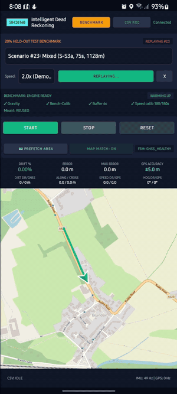<br/><sub><b>75 s GPS blackout, replayed on the phone (6x speed).</b><br/>Orange = Smart IDR, green = real GPS (shown only for comparison).</sub></td>
<td align="center" width="33%">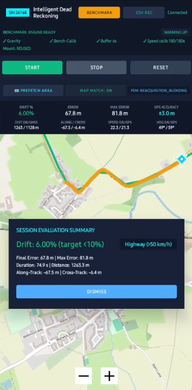<br/><sub><b>Result: 6.00 % drift</b> (67.8 m over 1128 m).<br/>GPS returns and the 3 s handoff blend starts.</sub></td>
<td align="center" width="33%">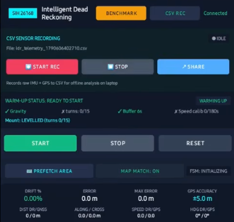<br/><sub><b>Self-calibration and data logging.</b><br/>Gravity, turns n/15, 6 s buffer, speed calibration.</sub></td>
</tr>
</table>

---

## In one minute

- **Problem.** In tunnels, underpasses, basements and dense city streets the GNSS signal drops. Navigation apps freeze or jump to the wrong road. Premium cars fall back on a factory INS and wheel sensors, but most Indian vehicles (two-wheelers, autos, trucks, older cars) only have the driver's phone, and naive integration of phone sensors drifts by **424 %** of the distance travelled.
- **Solution.** Smart IDR is a software engine that turns any smartphone, in any dashboard or handlebar mount, into a GNSS + INS navigator. An AI model reads vehicle speed from vibration, a 15-state error-state Kalman filter fuses it with the gyroscope, the track is matched to OpenStreetMap roads, and GNSS is blended back smoothly when it returns. **No OBD-II port, no wheel sensor, no internet.**
- **Proof.**
  - **12.03 %** median drift over **236 real-data blackout runs**, against 22.46 % without the map stages and 424 % for naive integration.
  - Confirmed on **120 held-out runs (11.15 %)** that were never used for tuning, and **9.66 %** on the two trips never seen in training.
  - The whole pipeline runs **standalone on a budget Android phone** (Samsung Galaxy F12) in about **13 ms per 100 ms step**, giving the same result as the laptop to **0.000 m**.

### At a glance

| | Result | How it was measured |
| :--- | :---: | :--- |
| Median drift during GNSS blackouts | **12.03 %** | 236 runs = 6 dev seeds x 40 scenarios on 5 real trips |
| Same engine without the map stages | 22.46 % | same 236 runs |
| Naive double integration of phone IMU | 424 % | historical 60 s blackout test (Phase 1) |
| Held-out confirmation (never used for tuning) | **11.15 %** | 120 runs = 3 held-out seeds x 40 scenarios |
| Trips never seen in training (S-S3a, S-S4) | **9.66 %** | held-out seeds, 60 runs |
| City driving, 20 to 50 km/h (PS target < 15 %) | **12.16 %**, target met | 152 runs |
| Runtime on a budget phone | **~13 ms per 100 ms step** | Samsung Galaxy F12, on-device logcat |
| Phone vs laptop result | **0.000 m** difference | all 6 bundled benchmark replays |
| Extra hardware | **none** | phone IMU + GNSS only |

---

## Contents

1. [The problem (PS 26168)](#1-the-problem-ps-26168)
2. [Our solution](#2-our-solution)
3. [Results](#3-results)
4. [It runs on a real phone](#4-it-runs-on-a-real-phone)
5. [System architecture](#5-system-architecture)
6. [How each part works](#6-how-each-part-works)
7. [Evaluation protocol and integrity](#7-evaluation-protocol-and-integrity)
8. [How we got here: pivots, failures and rejected ideas](#8-how-we-got-here)
9. [Honest status, risks and roadmap](#9-honest-status-risks-and-roadmap)
10. [Repository map](#10-repository-map)
11. [Quickstart and reproduction](#11-quickstart-and-reproduction)
12. [References](#12-references)

---

## 1. The problem (PS 26168)

**Why navigation fails without GNSS**

| GNSS drops out | Navigation breaks | Only a phone on board | Phone IMU alone drifts |
| :--- | :--- | :--- | :--- |
| Tunnels, underpasses, multi-level parking, urban canyons, jamming | Icon freezes or jumps, missed exits, late deliveries, unsafe last-second turns | Most Indian 2W, autos and trucks have no factory INS and no OBD-II speed feed | Cheap MEMS sensors, vibration, any mount angle: naive integration drifts **424 %** |

**What makes it hard in India**

- **No vehicle wiring.** Only the phone's accelerometer, gyroscope and GNSS can be used.
- **Any mount, any angle.** Portrait cradle, landscape dash mount, magnetic pad or a vibrating handlebar clamp; the phone can also shift during the trip.
- **Rough roads and stop-and-go traffic.** Potholes, speed breakers and engine idle vibration all look like motion to a naive system.
- **Magnetometer is unreliable.** Inside a steel cabin the compass is off by 28 to 76 degrees.

**Targets from the problem statement**

| Regime | Typical outage | PS target |
| :--- | :--- | :--- |
| Crawl, < 20 km/h | < 200 m | < 10 m position error |
| City, 20 to 50 km/h | 200 to 500 m | < 15 % of distance travelled |
| Highway, > 50 km/h | 500 m to 1.2 km | < 10 % of distance travelled |
| Overall | 30 to 75 s blackouts | < 10 % of distance travelled, seamless switch back to GNSS |

---

## 2. Our solution

Smart IDR runs continuously. While GNSS is healthy it **learns**: the phone's mounting angle, the gyro bias, the vehicle heading and a speed scale for the current road surface. When GNSS disappears it **dead-reckons** from the phone IMU, the AI speed model, the Kalman filter and the road map. When GNSS returns it **verifies** the first fixes and **blends** back over 3 seconds, so the icon never jumps.

<p align="center">
  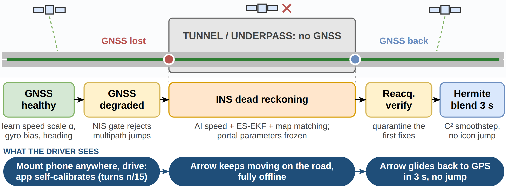
</p>

### What is new in our approach

| Idea | Why it matters |
| :--- | :--- |
| **AI speed from vibration** (Bayesian mixture-of-experts, trained on 10 Hz CAN wheel speed) | Gives forward speed with its own uncertainty, without any wheel sensor or OBD-II port |
| **Automatic mount calibration** (gravity levelling + centripetal yaw lock) | Works with any phone mount and orientation; no user setup |
| **GPS-vector heading seeder** instead of the magnetometer | The compass is off by 28 to 76 degrees inside a steel cabin |
| **Kinematic delta-v speed observer** | Removes the 1.3 s lag that window-based speed models have when braking |
| **Road-aware fusion** (15-state ES-EKF + topological OSM matcher + IRC:73 curvature governor + junction snap) | Keeps the track on real roads, through forks and turns |
| **Seamless handoff** (6-state FSM + 3 s Hermite blend) | GNSS comes back without an icon jump |
| **Leak-free evaluation** (dev seeds for tuning, held-out seeds only for confirmation, future-leak tests) | The numbers reflect how the system behaves on data it has not seen |

---

## 3. Results

**Metric.** *Drift* is the position error at the end of the blackout divided by the distance actually driven during the blackout (from GNSS truth), in percent. *Pure inertial* is the **same** AI speed + ES-EKF engine with the map stages switched off. All runs use real IO-VNBD driving data with 10 Hz CAN wheel speed.

### 3.1 Headline: 6 dev seeds x 40 scenarios (236 runs)

| Metric | Smart IDR | Pure inertial (no map) |
| :--- | :---: | :---: |
| **Median drift** | **12.03 %** | 22.46 % |
| Mean of the 6 seed medians | 12.32 % ± 1.13 | |
| P90 drift (worst 10 %) | 37.30 % | |
| Runs under 10 % drift | 42.37 % (100 / 236) | |
| Runs under 30 % drift | 83.90 % (198 / 236) | |
| Runs where Smart IDR beats pure inertial | 82.20 % (194 / 236) | |

*236 of the nominal 240 runs are evaluated; 4 blackouts fell off the edge of a trip and were dropped. Dev seeds: 541098, 75496, 314159, 12345, 987654, 45736. Source: `ppt_pack/data/summary_6seed.json`, `ppt_pack/data/runs_6seed.csv`.*

<p align="center">
  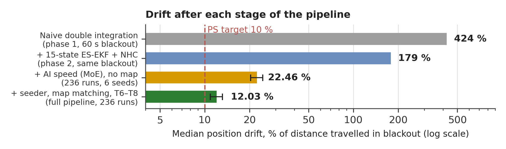
</p>

<p align="center">
  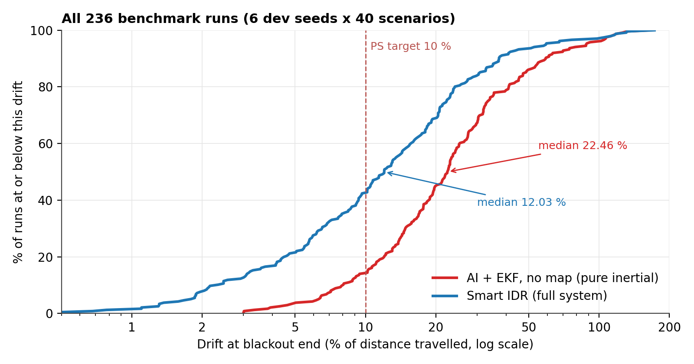
</p>

### 3.2 Independent confirmation: held-out seeds

Three seeds (319976, 480577, 473995) were drawn with `os.urandom`, frozen, and evaluated **once per round** for a single pre-declared candidate. They were never used for tuning or model selection.

| Metric (120 runs) | Before Round 1 | **Final production** |
| :--- | :---: | :---: |
| Median drift | 11.48 % | **11.15 %** |
| Mean of seed medians | 11.13 % ± 1.50 | **10.71 % ± 1.17** |
| P90 drift | 37.25 % | **32.91 %** |
| Runs under 10 % drift | 42.50 % | **48.33 %** |
| Runs under 30 % drift | | **85.83 %** |
| Unseen trips (S-S3a, S-S4), median | 11.89 % | **9.66 %** |
| Runs beating pure inertial | 83.33 % | **86.67 %** |

<p align="center">
  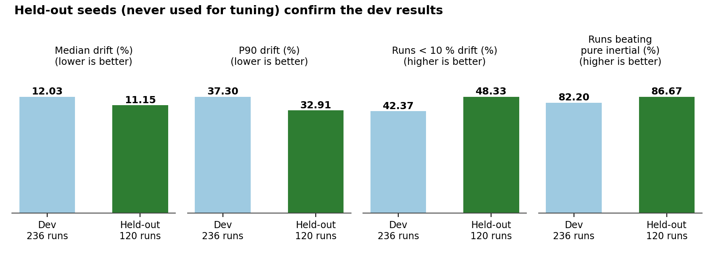
</p>

### 3.3 Scorecard against the problem statement

| Regime (mean speed in blackout) | Runs | PS target | Smart IDR | Gap to target |
| :--- | :---: | :---: | :---: | :--- |
| Crawl, < 20 km/h | 43 | < 10 m error | 15.82 m median | 5.8 m to go (drift 11.40 %) |
| **City, 20 to 50 km/h** | **152** | **< 15 % drift** | **12.16 % median** | **met** |
| Highway, > 50 km/h | 41 | < 10 % drift | 13.98 % median | 3.98 pp to go |
| All scenarios | 236 | < 10 % drift | 12.03 % median | 2.03 pp to go |
| Held-out check | 120 | < 10 % drift | 11.15 % median | 1.15 pp to go |

The plan to close the crawl and highway gaps is in [section 9](#9-honest-status-risks-and-roadmap).

### 3.4 Per trip and per scenario

| Trip | Road type | In training? | Runs | Smart IDR median | Pure inertial median | P90 | Beats pure inertial |
| :--- | :--- | :---: | :---: | :---: | :---: | :---: | :---: |
| S-M | Highway | yes (test split only) | 47 | **9.66 %** | 22.52 % | 22.48 % | 91.49 % |
| S-S2 | Arterial | yes (test split only) | 36 | **17.77 %** | 32.49 % | 58.49 % | 77.78 % |
| S-S1 | Urban | yes (test split only) | 36 | **10.71 %** | 16.39 % | 37.30 % | 77.78 % |
| S-S3a | Mixed | **never** | 58 | **10.96 %** | 21.41 % | 32.88 % | 79.31 % |
| S-S4 | Arterial | **never** | 59 | **13.37 %** | 22.41 % | 35.34 % | 83.05 % |

<p align="center">
  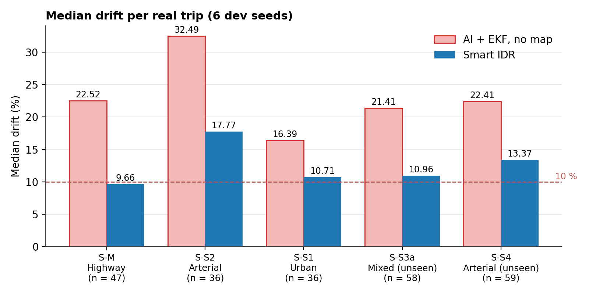
</p>

Each dot below is one of the 40 scenarios (median over the 6 seeds). Points under the diagonal are scenarios where the full system beats pure inertial: **38 of 40**. 15 scenarios finish under 10 % drift and 38 under 30 %.

<p align="center">
  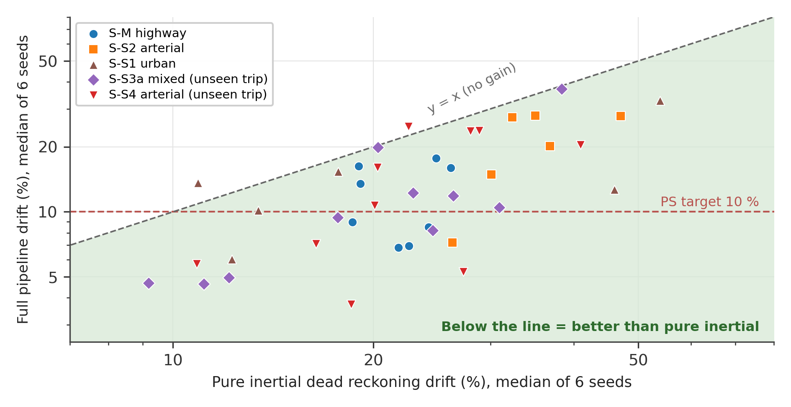
</p>

### 3.5 Real trajectories (current system, seed 541098)

Black dashed = GNSS truth · red dotted = pure inertial · blue = Smart IDR.

| #06 Highway, 30 s, 427 m | #33 Arterial (unseen trip), 60 s, 443 m | #18 Urban, 45 s, 99 m |
| :---: | :---: | :---: |
| 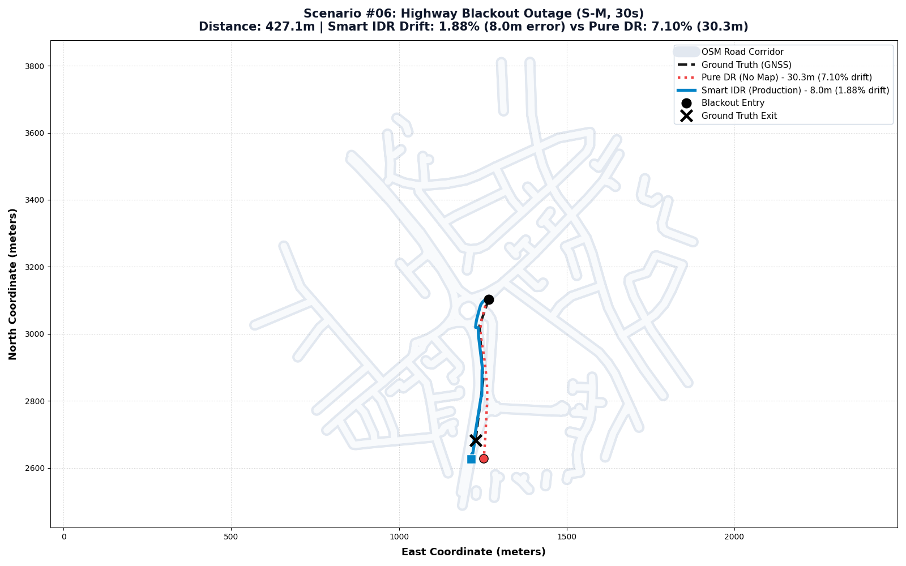 | 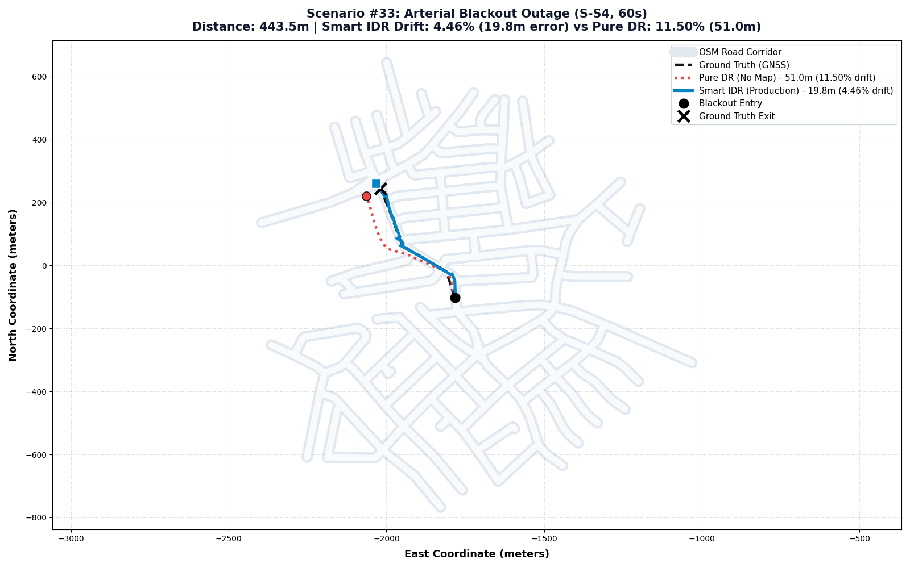 | 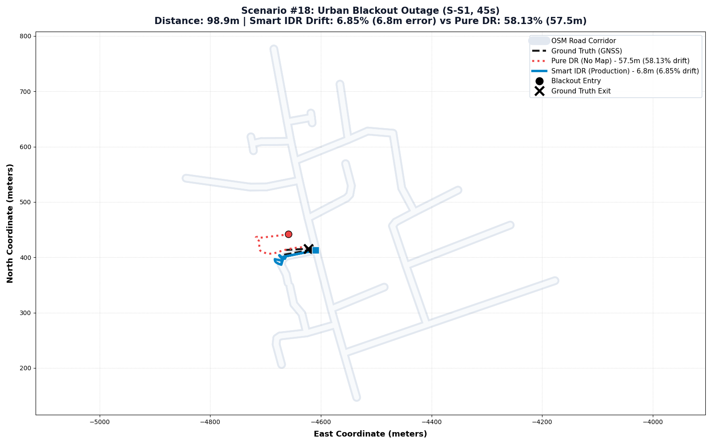 |
| **1.88 %** (8.0 m) vs pure 7.10 % | **4.46 %** (19.8 m) vs pure 11.50 % | **6.85 %** (6.8 m) vs pure 58.13 % |

Not every run is a win. On #30 (a short loop on an unseen trip) the full system gets 9.55 % while pure inertial happens to get 6.43 % on this seed ([plot](ppt_pack/images/trajectory_scenario_30.png)); all 40 scenarios are listed below.

<details>
<summary><b>All 40 scenarios (click to expand)</b></summary>

Medians over the 6 dev seeds, plus the single run on canonical seed 541098. "Improved" counts the seeds in which Smart IDR beat pure inertial.

| # | Trip | Road type | Speed regime | Blackout | Distance | Pure inertial (median) | **Smart IDR (median)** | Improved | Seed 541098 Smart IDR |
| :-: | :--- | :--- | :--- | :-: | :-: | :-: | :-: | :-: | :-: |
| 1 | S-M | Highway | city | 30 s | 301.5 m | 24.85 % | **17.75 %** | 6 / 6 | 22.70 % |
| 2 | S-M | Highway | city | 45 s | 600.2 m | 18.59 % | **8.96 %** | 6 / 6 | 9.66 % |
| 3 | S-M | Highway | highway | 75 s | 1174.6 m | 26.15 % | **16.01 %** | 6 / 6 | 9.35 % |
| 4 | S-M | Highway | city | 45 s | 326.7 m | 21.81 % | **6.83 %** | 6 / 6 | 20.70 % |
| 5 | S-M | Highway | crawl | 75 s | 288.6 m | 22.61 % | **6.96 %** | 6 / 6 | 10.75 % |
| 6 | S-M | Highway | highway | 30 s | 427.1 m | 24.20 % | **8.50 %** | 6 / 6 | 1.88 % |
| 7 | S-M | Highway | city | 60 s | 603.3 m | 19.13 % | **13.48 %** | 4 / 6 | 20.77 % |
| 8 | S-M | Highway | crawl | 60 s | 314.7 m | 19.00 % | **16.29 %** | 4 / 6 | 19.12 % |
| 9 | S-S2 | Arterial | city | 75 s | 872.1 m | 47.04 % | **27.73 %** | 4 / 6 | 116.41 % |
| 10 | S-S2 | Arterial | city | 30 s | 245.7 m | 30.07 % | **14.87 %** | 5 / 6 | 13.73 % |
| 11 | S-S2 | Arterial | city | 60 s | 435.6 m | 35.02 % | **27.89 %** | 5 / 6 | 2.47 % |
| 12 | S-S2 | Arterial | city | 45 s | 262.0 m | 36.83 % | **20.14 %** | 5 / 6 | 26.62 % |
| 13 | S-S2 | Arterial | city | 45 s | 331.6 m | 26.31 % | **7.20 %** | 6 / 6 | 2.09 % |
| 14 | S-S2 | Arterial | city | 30 s | 202.6 m | 32.36 % | **27.46 %** | 3 / 6 | 17.33 % |
| 15 | S-S1 | Urban | city | 45 s | 399.7 m | 17.70 % | **15.39 %** | 6 / 6 | 16.28 % |
| 16 | S-S1 | Urban | city | 30 s | 200.5 m | 13.43 % | **10.15 %** | 5 / 6 | 9.63 % |
| 17 | S-S1 | Urban | crawl | 75 s | 102.8 m | 12.26 % | **6.04 %** | 4 / 6 | 11.14 % |
| 18 | S-S1 | Urban | crawl | 45 s | 98.9 m | 46.03 % | **12.68 %** | 6 / 6 | 6.85 % |
| 19 | S-S1 | Urban | city | 30 s | 361.8 m | 10.90 % | **13.63 %** | 2 / 6 | 2.34 % |
| 20 | S-S1 | Urban | crawl | 60 s | 135.1 m | 53.95 % | **32.70 %** | 4 / 6 | 27.40 % |
| 21 | S-S3a | Mixed | city | 30 s | 325.9 m | 17.67 % | **9.43 %** | 5 / 6 | 1.86 % |
| 22 | S-S3a | Mixed | city | 45 s | 475.2 m | 11.12 % | **4.64 %** | 6 / 6 | 2.57 % |
| 23 | S-S3a | Mixed | highway | 75 s | 1128.4 m | 12.13 % | **4.96 %** | 5 / 6 | 6.54 % |
| 24 | S-S3a | Mixed | highway | 30 s | 603.9 m | 20.33 % | **19.91 %** | 4 / 6 | 20.47 % |
| 25 | S-S3a | Mixed | city | 45 s | 614.3 m | 9.19 % | **4.68 %** | 5 / 6 | 3.58 % |
| 26 | S-S3a | Mixed | city | 75 s | 892.8 m | 22.96 % | **12.26 %** | 5 / 6 | 13.12 % |
| 27 | S-S3a | Mixed | city | 60 s | 591.9 m | 26.35 % | **11.86 %** | 6 / 6 | 5.37 % |
| 28 | S-S3a | Mixed | city | 45 s | 374.5 m | 24.55 % | **8.21 %** | 6 / 6 | 4.39 % |
| 29 | S-S3a | Mixed | crawl | 30 s | 164.3 m | 30.93 % | **10.46 %** | 2 / 6 | 5.89 % |
| 30 | S-S3a | Mixed | crawl | 60 s | 244.2 m | 38.37 % | **37.09 %** | 4 / 6 | 9.55 % |
| 31 | S-S4 | Arterial | city | 45 s | 490.9 m | 20.07 % | **10.73 %** | 6 / 6 | 4.13 % |
| 32 | S-S4 | Arterial | city | 75 s | 610.9 m | 10.86 % | **5.75 %** | 6 / 6 | 27.33 % |
| 33 | S-S4 | Arterial | city | 60 s | 443.5 m | 22.57 % | **24.80 %** | 3 / 6 | 4.46 % |
| 34 | S-S4 | Arterial | city | 45 s | 328.3 m | 27.32 % | **5.27 %** | 5 / 6 | 1.31 % |
| 35 | S-S4 | Arterial | city | 75 s | 466.0 m | 16.40 % | **7.11 %** | 5 / 6 | 36.17 % |
| 36 | S-S4 | Arterial | highway | 45 s | 739.7 m | 28.84 % | **23.73 %** | 4 / 6 | 12.90 % |
| 37 | S-S4 | Arterial | highway | 30 s | 677.8 m | 20.30 % | **16.08 %** | 5 / 6 | 30.96 % |
| 38 | S-S4 | Arterial | highway | 60 s | 931.8 m | 27.99 % | **23.70 %** | 5 / 6 | 32.74 % |
| 39 | S-S4 | Arterial | city | 30 s | 186.9 m | 40.96 % | **20.46 %** | 5 / 5 | 13.04 % |
| 40 | S-S4 | Arterial | city | 30 s | 181.3 m | 18.53 % | **3.72 %** | 3 / 3 | 97.88 % |

*Scenarios 39 and 40 have fewer than 6 seeds because some blackout placements fell off the end of the trip. The speed regime is set per run from the mean speed in the blackout, so one scenario can fall into different regimes on different seeds; this column shows it for seed 541098. Source: `ppt_pack/data/summary_6seed.json` (per_scenario) and `ppt_pack/data/runs_6seed.csv`.*

</details>

### 3.6 Where the remaining error comes from

Splitting the final error into along-track (speed) and cross-track (heading) parts shows that **speed is the main remaining error source**. This is why Round 1 and Round 2 focused on speed calibration.

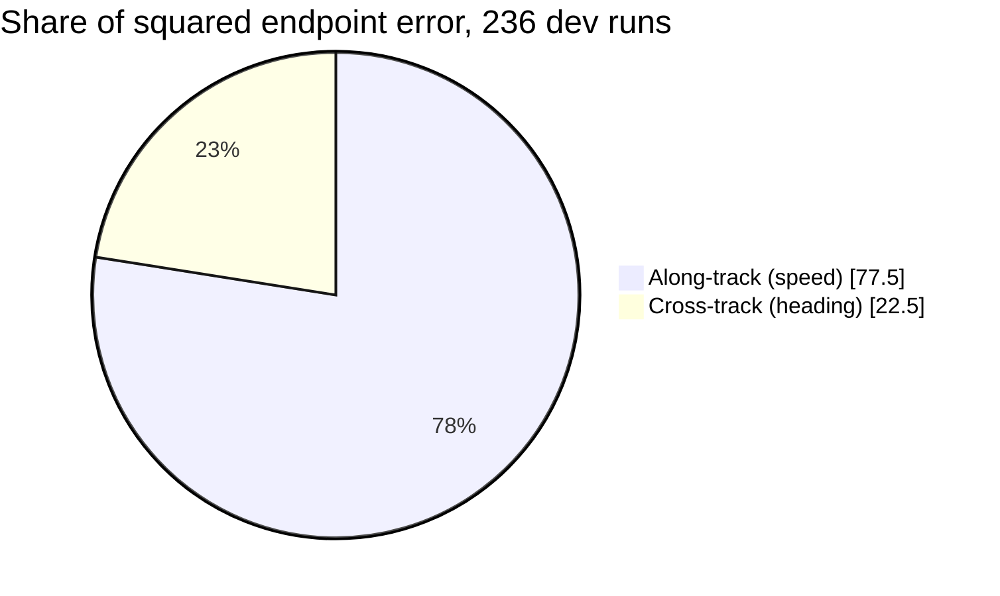
```mermaid
pie showData
    title Share of squared endpoint error, 236 dev runs
    "Along-track (speed)" : 77.5
    "Cross-track (heading)" : 22.5
```

Source: `results/round1/hdg_seed/production_scenarios.csv` (the decomposition satisfies `sqrt(along^2 + cross^2) = error`). Initial heading from the GPS-vector seeder: **18.18° mean / 7.05° median** error over the same 236 runs.

---

## 4. It runs on a real phone

The full pipeline runs **standalone on the phone**: Kotlin reads the sensors, runs the TFLite speed model and draws the map, and the same Python engine used for the benchmark runs on the phone through Chaquopy (SciPy is replaced by a small pure-NumPy module). No laptop, no server and no internet are needed once the road map is cached. A laptop/server mode still exists for development.

| | On-device result |
| :--- | :--- |
| Test phone | Samsung Galaxy F12 (SM-F127G, Exynos 850), Android 13 |
| Speed model | TFLite FP32, **2.50 MB**; max difference vs PyTorch 4.77e-6 m/s (ONNX 5.72e-6 m/s) over 1,000 real windows |
| Time per 100 ms of sensor data | **12.78 ms mean**, P95 13.66 ms, max 14.82 ms (features 0.84 · model 9.0 · EKF + map 2.35 ms) |
| Phone vs laptop | **0.000 m** endpoint difference on all 6 bundled benchmark replays |
| Offline | Works in airplane mode; roads are prefetched once (3 km radius) and cached |
| Handoff | 6-state FSM with a 3 s Hermite blend in sensor time (display layer; it does not change the accuracy numbers) |
| Not measured yet | Battery drain and a real drive on Indian roads (planned, see section 9) |

**Benchmark replays on the phone** (each bundle holds the road network, the locked mount alignment, the pre-blackout history and the sensor batches for one fixed blackout placement, so these single-replay values differ from the 6-seed medians above):

| Scenario | Trip | Blackout | Distance | Laptop error | **Phone error** | Drift |
| :-: | :--- | :-: | :-: | :-: | :-: | :-: |
| #01 | S-M, highway | 30 s | 301.5 m | 80.59 m | **80.59 m** | 26.73 % |
| #22 | S-S3a, mixed | 45 s | 475.1 m | 16.77 m | **16.77 m** | 3.53 % |
| #23 | S-S3a, mixed | 75 s | 1128.4 m | 67.76 m | **67.76 m** | 6.00 % |
| #25 | S-S3a, mixed | 45 s | 614.3 m | 77.30 m | **77.30 m** | 12.58 % |
| #26 | S-S3a, mixed | 75 s | 892.8 m | 122.80 m | **122.80 m** | 13.75 % |
| #30 | S-S3a, mixed | 60 s | 244.2 m | 7.04 m | **7.04 m** | 2.88 % |

<table>
<tr>
<td align="center">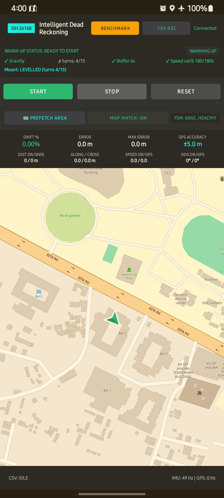<br/><sub>Live mode on the IIIT Allahabad campus, airplane mode, warm-up checks on the phone</sub></td>
<td align="center">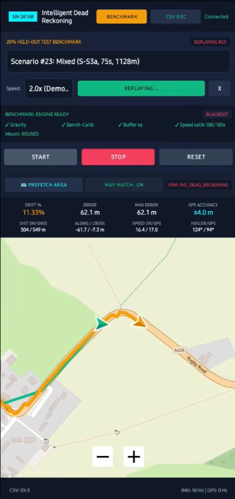<br/><sub>Scenario #23 mid-blackout: FSM in INS_DEAD_RECKONING, orange track follows the road</sub></td>
<td align="center">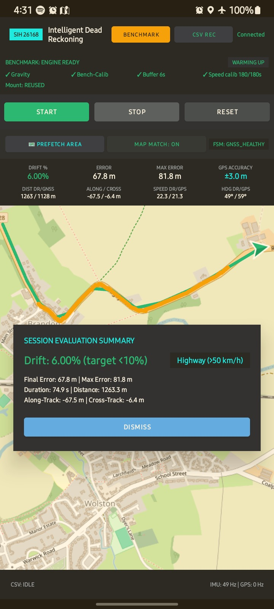<br/><sub>Scenario #23 result on the phone in airplane mode: 6.0 % drift, same as the laptop</sub></td>
</tr>
</table>

### What runs where on the phone

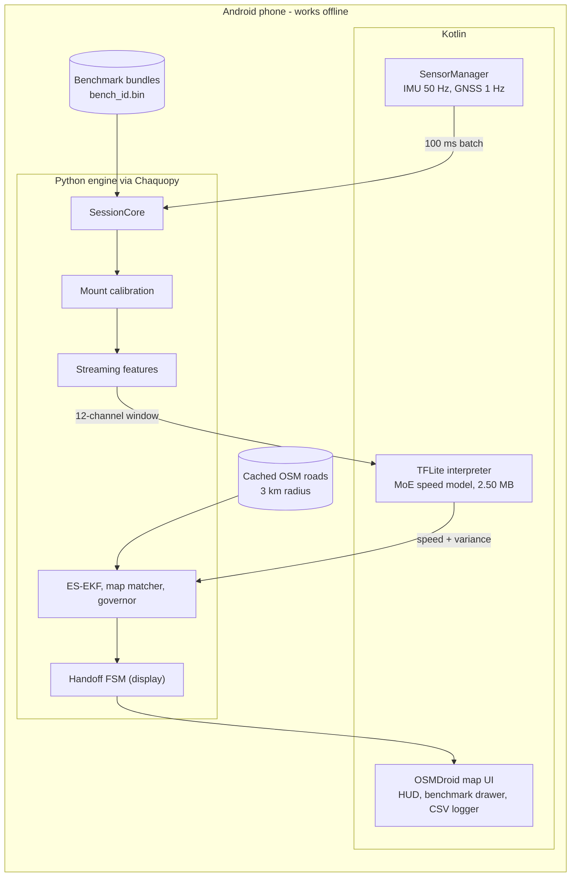
```mermaid
flowchart TB
    subgraph PHONE["Android phone - works offline"]
        direction TB
        subgraph KOT["Kotlin"]
            SEN["SensorManager<br/>IMU 50 Hz, GNSS 1 Hz"]
            TFL["TFLite interpreter<br/>MoE speed model, 2.50 MB"]
            UI["OSMDroid map UI<br/>HUD, benchmark drawer, CSV logger"]
        end
        subgraph PY["Python engine via Chaquopy"]
            SC["SessionCore"]
            MC["Mount calibration"]
            FE["Streaming features"]
            EK["ES-EKF, map matcher, governor"]
            HD["Handoff FSM (display)"]
        end
        CACHE[("Cached OSM roads<br/>3 km radius")]
        BUN[("Benchmark bundles<br/>bench_id.bin")]
    end
    SEN -->|"100 ms batch"| SC
    SC --> MC --> FE
    FE -->|"12-channel window"| TFL
    TFL -->|"speed + variance"| EK
    CACHE --> EK
    BUN --> SC
    EK --> HD --> UI
```

### One 100 ms step on the phone

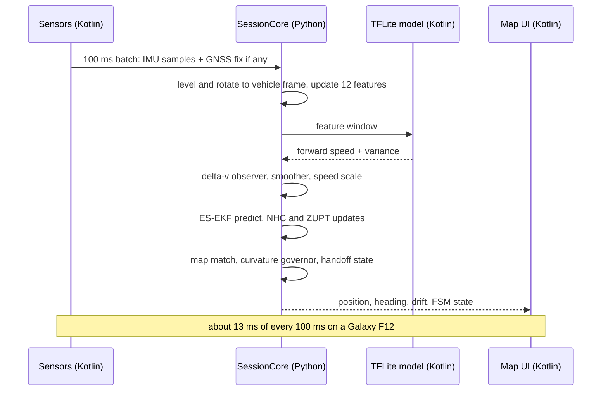
```mermaid
sequenceDiagram
    participant S as Sensors (Kotlin)
    participant E as SessionCore (Python)
    participant M as TFLite model (Kotlin)
    participant U as Map UI (Kotlin)
    S->>E: 100 ms batch: IMU samples + GNSS fix if any
    E->>E: level and rotate to vehicle frame, update 12 features
    E->>M: feature window
    M-->>E: forward speed + variance
    E->>E: delta-v observer, smoother, speed scale
    E->>E: ES-EKF predict, NHC and ZUPT updates
    E->>E: map match, curvature governor, handoff state
    E-->>U: position, heading, drift, FSM state
    Note over S,U: about 13 ms of every 100 ms on a Galaxy F12
```

---

## 5. System architecture

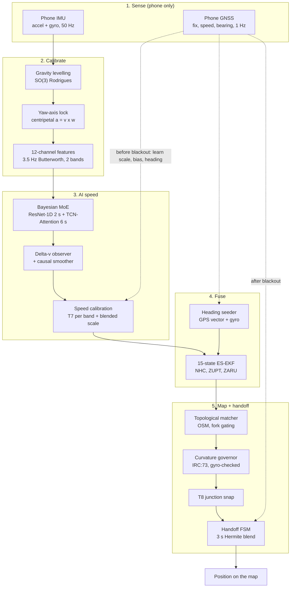
```mermaid
flowchart TB
    subgraph S1["1. Sense (phone only)"]
        direction LR
        IMU["Phone IMU<br/>accel + gyro, 50 Hz"]
        GNSS["Phone GNSS<br/>fix, speed, bearing, 1 Hz"]
    end
    subgraph S2["2. Calibrate"]
        direction LR
        LVL["Gravity levelling<br/>SO(3) Rodrigues"] --> YAW["Yaw-axis lock<br/>centripetal a = v x w"] --> FEAT["12-channel features<br/>3.5 Hz Butterworth, 2 bands"]
    end
    subgraph S3["3. AI speed"]
        direction LR
        MOE["Bayesian MoE<br/>ResNet-1D 2 s + TCN-Attention 6 s"] --> OBS["Delta-v observer<br/>+ causal smoother"] --> CAL["Speed calibration<br/>T7 per band + blended scale"]
    end
    subgraph S4["4. Fuse"]
        direction LR
        SEED["Heading seeder<br/>GPS vector + gyro"] --> EKF["15-state ES-EKF<br/>NHC, ZUPT, ZARU"]
    end
    subgraph S5["5. Map + handoff"]
        direction LR
        MM["Topological matcher<br/>OSM, fork gating"] --> GOV["Curvature governor<br/>IRC:73, gyro-checked"] --> T8["T8 junction snap"] --> HO["Handoff FSM<br/>3 s Hermite blend"]
    end
    IMU --> LVL
    FEAT --> MOE
    CAL --> EKF
    GNSS -.->|"before blackout: learn scale, bias, heading"| CAL
    GNSS -.-> SEED
    EKF --> MM
    GNSS -.->|"after blackout"| HO
    HO --> OUT["Position on the map"]
```

<p align="center">
  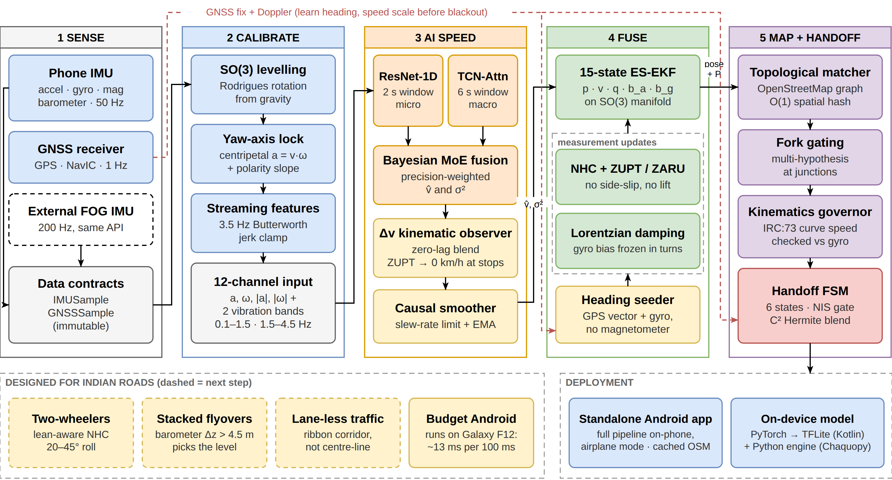
</p>

<p align="center">
  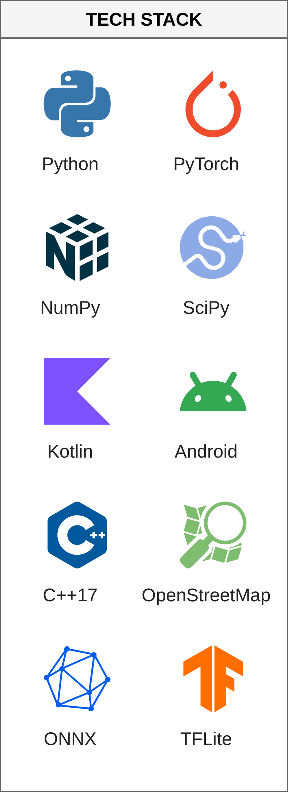
</p>

**Design principle.** Every stage talks to the next through immutable data contracts (`sih/core/contracts.py`), so each block can be tested alone and swapped without touching the others:

```
IMUSample -> CalibratedSample -> VelocityEstimate -> FusedPosition -> MatchedPosition
```

| Contract | Fields |
| :--- | :--- |
| `IMUSample` | `timestamp_ns`, `accel_mps2[3]`, `gyro_radps[3]`, `mag_ut[3]` (optional) |
| `CalibratedSample` | `timestamp_ns`, `accel_veh[3]`, `gyro_veh[3]`, `is_stationary` |
| `VelocityEstimate` | `timestamp_ns`, `forward_speed_mps`, `variance`, `speed_scale_factor` |
| `FusedPosition` | `timestamp_ns`, `lat`, `lon`, `alt_m`, `heading_rad`, `v_enu_mps[3]`, `cov_enu[3,3]` |
| `MatchedPosition` | `timestamp_ns`, `lat`, `lon`, `heading_rad`, `segment_id`, `distance_to_edge_m`, `confidence` |

---

## 6. How each part works

### 6.1 Mount auto-calibration (`sih/calibration/mount.py`)

The phone can sit at any angle, so the engine first finds how the phone is rotated relative to the vehicle.

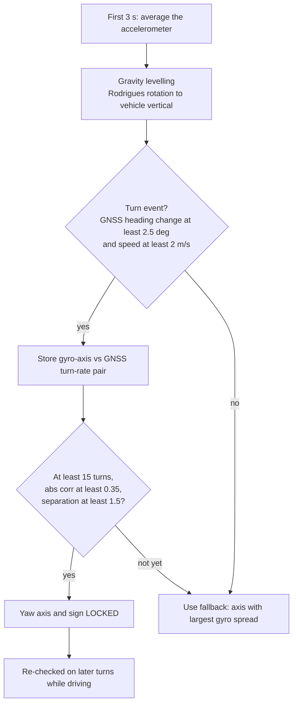
```mermaid
flowchart TD
    A["First 3 s: average the accelerometer"] --> B["Gravity levelling<br/>Rodrigues rotation to vehicle vertical"]
    B --> C{"Turn event?<br/>GNSS heading change at least 2.5 deg<br/>and speed at least 2 m/s"}
    C -->|yes| D["Store gyro-axis vs GNSS turn-rate pair"]
    D --> E{"At least 15 turns,<br/>abs corr at least 0.35,<br/>separation at least 1.5?"}
    E -->|yes| F["Yaw axis and sign LOCKED"]
    E -->|not yet| G["Use fallback: axis with largest gyro spread"]
    C -->|no| G
    F --> H["Re-checked on later turns while driving"]
```

<details>
<summary>Maths and details</summary>

- **Gravity levelling.** `g_hat = mean(a_phone) / norm(mean(a_phone))`, target `u = [0, 0, 1]`. Axis `r = cross(g_hat, u)`, angle `theta = atan2(norm(r), dot(g_hat, u))`, then `R_level = I + [r]x sin(theta) + [r]x^2 (1 - cos(theta))`.
- **Forward axis from turns.** For each genuine turn, the integrated rotation on every gyro axis is compared with the GNSS heading change. The yaw axis is `argmax_a (abs(r_a) * (E_a + 1e-6))`, where `r_a` is the correlation and `E_a` the turn energy on that axis, so a noisy axis during straight driving cannot win.
- **Sign.** From the least-squares slope between gyro rate and GNSS turn rate.
- **App.** The warm-up panel shows `Gravity`, `turns n/15`, `Buffer 6s` and `Speed calib n/180s`; a START before the lock gives a warning.

</details>

### 6.2 AI speed estimation (`sih/models/moe_fusion.py`)

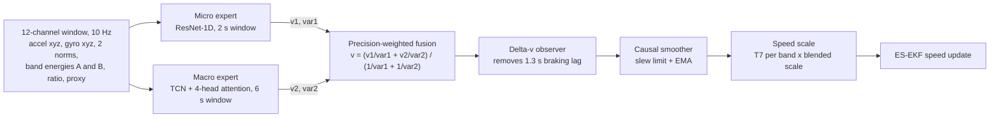
```mermaid
flowchart LR
    X["12-channel window, 10 Hz<br/>accel xyz, gyro xyz, 2 norms,<br/>band energies A and B, ratio, proxy"] --> R["Micro expert<br/>ResNet-1D, 2 s window"]
    X --> T["Macro expert<br/>TCN + 4-head attention, 6 s window"]
    R -->|"v1, var1"| B["Precision-weighted fusion<br/>v = (v1/var1 + v2/var2) / (1/var1 + 1/var2)"]
    T -->|"v2, var2"| B
    B --> O["Delta-v observer<br/>removes 1.3 s braking lag"]
    O --> SM["Causal smoother<br/>slew limit + EMA"]
    SM --> K["Speed scale<br/>T7 per band x blended scale"]
    K --> EKF["ES-EKF speed update"]
```

| Part | Detail |
| :--- | :--- |
| Input features | Levelled accel and gyro (6), accel and gyro norms (2), vibration energy in band A 0.1 to 1.5 Hz and band B 1.5 to 4.5 Hz, their ratio and a speed proxy (4); 2nd-order Butterworth low-pass at 3.5 Hz; jerk clamp 15 m/s^3 |
| Training truth | 10 Hz CAN wheel speed (phone GPS speed lags by up to 9 s, so it was not used as truth); S-S4 excluded from CAN supervision because its logger clock is not consistent |
| Production checkpoint | `models/checkpoints/round1_interval_lam0.5_s42.pt`, fine-tuned with the T6 interval loss `L = L_phase55 + 0.5 * L_interval` over 30 to 75 s horizons; median pre-blackout speed ratio moved from 1.13 to 1.03 |
| Delta-v observer | `v_kin(t) = max(0, v(t-1) + (a_x(t) - b_ax) * dt)`; during hard braking or acceleration (abs(a_x) at least 0.35 m/s^2) 82 % weight goes to the kinematic path, otherwise 65 % |
| Smoother | Acceleration limited to -5.0 to +3.5 m/s^2, EMA with tau = 0.25 s |

### 6.3 Speed calibration before the blackout

While GNSS is still available the engine measures how far off the AI speed is on the current road surface:

```
scale   = 0.5 * (15 s entry GNSS/AI speed ratio) + 0.5 * (180 s GNSS/AI distance ratio)
scale   = clip(scale, 0.85, 1.25)          # 1.35 on highway
f_band  = per-speed-band factor (T7), bands 0-5-10-15-22-60 m/s, shrunk toward 1.0, clip [0.85, 1.15]
v_used  = v_AI * scale * f_band(v_AI)
```

With less than about 180 s of history (cold start) the factors fall back to 1.0.

### 6.4 15-state error-state Kalman filter (`sih/fusion/es_ekf.py`)

```
state  x  = [p (3), v (3), q (attitude), b_a (3), b_g (3)]     error state: 15
NHC       : lateral and vertical body velocity = 0, sigma_lat = max(0.1, 1.2 * abs(w_z))
ZUPT/ZARU : when accel variance < 0.04, abs(norm(a) - 9.81) < 0.6 and norm(w) < 0.04 rad/s
            -> speed clamped to 0 and gyro bias updated against zero rotation
gyro bias : update damped in turns, gamma = 1 / (1 + (abs(w_z) / 0.02)^2)
heading   : seeded from the last moving GNSS fix (v >= 2.5 m/s) + integrated gyro, not the magnetometer
```

### 6.5 Map matching, governor and junction snap (`sih/map/`, `sih/round1/junction_anchor.py`)

| Part | Detail |
| :--- | :--- |
| Road network | OpenStreetMap polylines in a 100 m hash grid; successor graph links segments whose ends are within 8 m |
| Matching score | `exp(-0.5 (d / 6 m)^2) * exp(-0.5 (dheading / 20 deg)^2)`; rejected beyond 15 m or 40 deg; several hypotheses kept at forks |
| Curvature governor | `v_max = sqrt(a_lat_max / curvature)`, a_lat_max 2.2 m/s^2 on highways and 3.5 m/s^2 elsewhere, capped at 33.3 m/s; OSM waypoint kinks (false 6.2 m/s^2 spikes) are filtered against the real gyro rate |
| T8 junction snap | After a completed turn of 50 to 140 deg, position is moved **along** the new road to the matching corner (gain 0.7, at most 40 m) |
| Offline map | Roads prefetched for a 3 km radius and cached on the phone |

### 6.6 Seamless handoff (`sih/handoff/`)

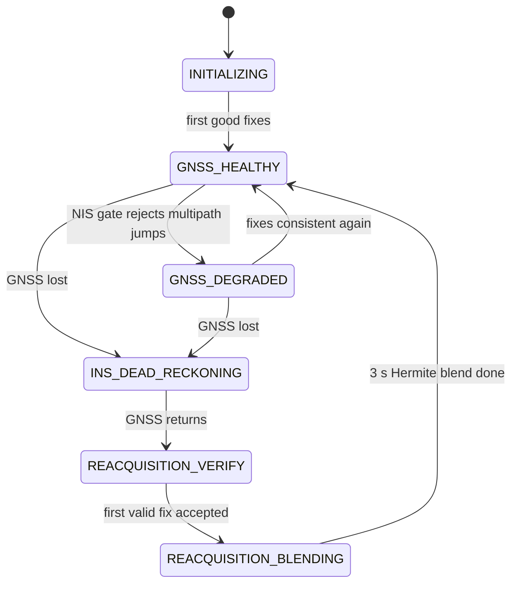
```mermaid
stateDiagram-v2
    [*] --> INITIALIZING
    INITIALIZING --> GNSS_HEALTHY: first good fixes
    GNSS_HEALTHY --> GNSS_DEGRADED: NIS gate rejects multipath jumps
    GNSS_DEGRADED --> GNSS_HEALTHY: fixes consistent again
    GNSS_HEALTHY --> INS_DEAD_RECKONING: GNSS lost
    GNSS_DEGRADED --> INS_DEAD_RECKONING: GNSS lost
    INS_DEAD_RECKONING --> REACQUISITION_VERIFY: GNSS returns
    REACQUISITION_VERIFY --> REACQUISITION_BLENDING: first valid fix accepted
    REACQUISITION_BLENDING --> GNSS_HEALTHY: 3 s Hermite blend done
```

During `REACQUISITION_VERIFY` the display holds the dead-reckoning position until a valid fix arrives, then a C2-continuous Hermite smoothstep moves the icon to the GNSS position over 3 seconds. The accuracy numbers in section 3 are measured at the end of the blackout, before this blend.

---

## 7. Evaluation protocol and integrity

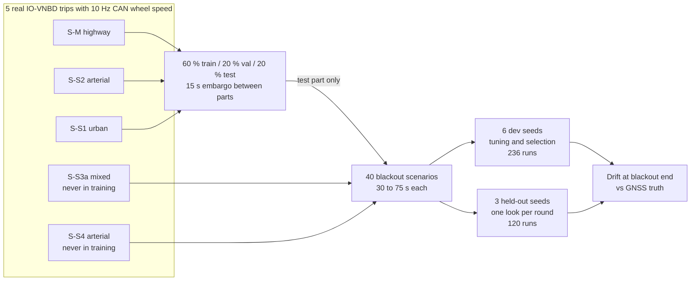
```mermaid
flowchart LR
    subgraph TRIPS["5 real IO-VNBD trips with 10 Hz CAN wheel speed"]
        SM["S-M highway"]
        S2["S-S2 arterial"]
        S1["S-S1 urban"]
        S3["S-S3a mixed<br/>never in training"]
        S4["S-S4 arterial<br/>never in training"]
    end
    SM --> SPLIT["60 % train / 20 % val / 20 % test<br/>15 s embargo between parts"]
    S2 --> SPLIT
    S1 --> SPLIT
    SPLIT -->|"test part only"| SC["40 blackout scenarios<br/>30 to 75 s each"]
    S3 --> SC
    S4 --> SC
    SC --> DEV["6 dev seeds<br/>tuning and selection<br/>236 runs"]
    SC --> HO["3 held-out seeds<br/>one look per round<br/>120 runs"]
    DEV --> MET["Drift at blackout end<br/>vs GNSS truth"]
    HO --> MET
```

| Rule | How it is enforced |
| :--- | :--- |
| Split by whole trips and time blocks, never by rows | `sih/data/split.py`: 60 / 20 / 20 per trip with 15 s embargo gaps; S-S3a and S-S4 never used for training |
| Dev seeds for tuning, held-out seeds only for confirmation | 3 held-out seeds drawn with `os.urandom`, looked at once per round for one pre-declared candidate (2 looks in total) |
| No future data inside a blackout | `tests/test_no_future_leak.py`: all sensor data after the blackout is replaced with NaN and the trajectory stays bit-identical; road networks built only from data before the blackout give the same result |
| Batch benchmark = live streaming = phone | `scripts/quick_parity.py` shows 0.0000 m difference between batch and live paths; the phone matches the laptop to 0.000 m on all 6 bundles |
| Paired statistics for every change | Each candidate is compared scenario by scenario with a sign test (for example the blended speed scale: 78 better vs 53 worse, p = 0.036) |
| Every number traceable | Numbers in this README are registered with their source file in `docs/NUMBER_SOURCES.json` and checked by `scripts/check_number_registry.py` and `scripts/check_doc_numbers.py` |

---

## 8. How we got here

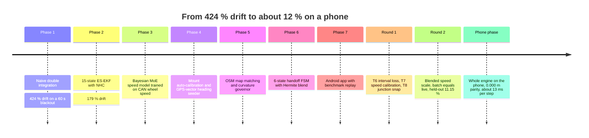
```mermaid
timeline
    title From 424 % drift to about 12 % on a phone
    Phase 1 : Naive double integration : 424 % drift on a 60 s blackout
    Phase 2 : 15-state ES-EKF with NHC : 179 % drift
    Phase 3 : Bayesian MoE speed model trained on CAN wheel speed
    Phase 4 : Mount auto-calibration and GPS-vector heading seeder
    Phase 5 : OSM map matching and curvature governor
    Phase 6 : 6-state handoff FSM with Hermite blend
    Phase 7 : Android app with benchmark replay
    Round 1 : T6 interval loss, T7 speed calibration, T8 junction snap
    Round 2 : Blended speed scale, batch equals live, held-out 11.15 %
    Phone phase : Whole engine on the phone, 0.000 m parity, about 13 ms per step
```

### 8.1 What real data taught us

| We assumed | Real data showed | So we built |
| :--- | :--- | :--- |
| A neural net can learn heading from the IMU and compass | Cabin steel bends the compass by 28 to 76 degrees | Physics heading fusion + GPS-vector seeder |
| Phone GPS speed is good ground truth | Phone GPS speed lags by up to 9 s | Supervision on 10 Hz CAN wheel speed with measured clock offsets |
| Neural speed can feed the integrator directly | 1.3 s window lag when braking, idle vibration looks like motion | Delta-v kinematic observer + ZUPT |
| OSM polylines give the true road curvature | Waypoint kinks cause false 6.2 m/s^2 lateral spikes | Curvature governor checked against the gyro (IRC:73) |
| Speed is roughly right after training | 77.5 % of the remaining error is along-track (speed) | T6 interval loss, T7 per-band calibration, blended 15 s + 180 s speed scale |

### 8.2 Tested and rejected

| Idea | Result on real data | Decision |
| :--- | :--- | :--- |
| T3 sticky stop detector | Never fired on the 236 benchmark runs | Rejected |
| T4 gyro scale calibration | Cross-track error increased | Rejected |
| T5 hold or decay speed in long blackouts | Premature slow-down increased along-track error | Rejected |
| T9 double speed-scale fix | The suspected bug does not occur (EKF scale about 1.000) | Rejected |
| T10 wider speed-scale clip bounds | P90 drift worse by 2.0 to 4.1 pp | Rejected |
| 3-model seed ensemble | Worse error tail on held-out seeds | Rejected |
| Doppler entry bearing | 16 better vs 23 worse (p = 0.337) | Rejected, geometric bearing kept |
| Route-level DFS matcher | 12.78 % enabled vs 11.59 % disabled in the ablation | Implemented, disabled by default |

<details>
<summary><b>20 physical failure modes we hit and how each is handled (click to expand)</b></summary>

| # | Failure mode | Root cause | What we do |
| :-: | :--- | :--- | :--- |
| 1 | Crawl drift at red lights | Engine idle vibration looks like motion | ZUPT in batch and live paths + causal speed smoothing |
| 2 | Wrong compass heading | Cabin steel and electronics, 28 to 76 degrees | GPS-vector heading seeder, magnetometer not used |
| 3 | GPS speed stair-steps | Phone GNSS smoothing, up to 9 s delay | CAN wheel-speed supervision |
| 4 | 1.3 s braking lag | Rolling 2 to 6 s windows | Delta-v kinematic observer |
| 5 | False curvature spikes | OSM waypoint kinks | Governor filters curvature against gyro rate |
| 6 | Gyro bias corrupted in turns | Centripetal leakage | Lorentzian turn damping of bias updates |
| 7 | Wrong branch at forks | Single-hypothesis snapping | Multi-hypothesis fork gating + anti-boundary watchdog |
| 8 | High-speed scale compression | Loss compresses high speeds | Scale-balanced loss (sum of predicted / true speed about 1.00) |
| 9 | Smooth asphalt under-reading | Less vibration at speed | T6 interval loss, T7 calibration, blended scale |
| 10 | Overshoot after junction turns | Matcher lags through acute turns | T8 along-road corner snap (up to 40 m) |
| 11 | Phone shifts in the mount | Vibration or a knock | Mount guard watches gravity shifts over 5 degrees and recalibrates |
| 12 | Phantom curvature on straights | Residual gyro bias at high speed | Straight-line lock in `es_ekf.py` (implemented, not in the production profile) |
| 13 | Jumps at tunnel exits | Multipath on the first fixes | Handoff FSM with verification and 3 s blend (on the phone as display handoff) |
| 14 | Map marker rotated the wrong way | OSMDroid rotates counter-clockwise | `MarkerHeading.toMarkerRotation` |
| 15 | S-S4 CAN out of sync | Logger clock not consistent | S-S4 excluded from CAN supervision |
| 16 | Batch vs live mismatch | Different warm-up and bearing rules | Unified warm-up and geometric entry bearing (0.0000 m parity) |
| 17 | Error measured past the blackout | Evaluation boundary bug | Evaluation stops exactly at blackout end |
| 18 | Crawl clamp choked take-off | Over-aggressive low-speed clamp | Clamp removed, rest detector + ZUPT only |
| 19 | Blackout before mount lock | User starts too early | Gravity in 3 s, buffer in 6 s, fallback axis, warning on START |
| 20 | Route matcher stalls | DFS on complex junctions | Route matching disabled by default |

</details>

---

## 9. Honest status, risks and roadmap

| Built and measured | Not done yet |
| :--- | :--- |
| Full engine, batch and live, with 0.0000 m parity | Real drive test on Indian roads |
| Android app running the whole pipeline on the phone (~13 ms per step) | Battery measurement |
| Benchmark replay on the phone, 0.000 m vs laptop on 6 bundles | Only 6 of the 40 scenarios are bundled in the app |
| Offline road prefetch and cache, CSV logger, handoff display | Mount lock is not yet saved across app restarts |
| 160 automated tests (2 skipped), leak and parity tests | Crawl < 10 m and highway < 10 % targets |

| Risk | How Smart IDR handles it today | Next |
| :--- | :--- | :--- |
| Trained on UK trips; Indian roads differ | Speed scale re-learnt from GNSS before every blackout | Indian drives with OBD speed truth, fine-tune |
| Crawl traffic | ZUPT + delta-v observer hold speed at stops | Crawl-specific tuning |
| Phone shifts in its mount | Mount re-checked on turns, status shown on screen | Save the mount lock per vehicle |
| No map for a new area | Area prefetched once and cached | Automatic download along the route |
| Battery and heat on budget phones | ~13 ms of every 100 ms today | INT8 model |

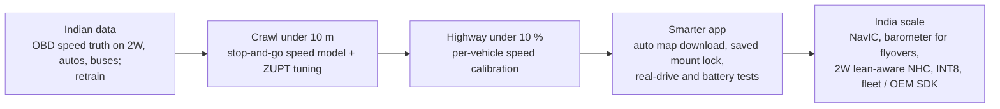
```mermaid
flowchart LR
    A["Indian data<br/>OBD speed truth on 2W, autos, buses;<br/>retrain"] --> B["Crawl under 10 m<br/>stop-and-go speed model + ZUPT tuning"]
    B --> C["Highway under 10 %<br/>per-vehicle speed calibration"]
    C --> D["Smarter app<br/>auto map download, saved mount lock,<br/>real-drive and battery tests"]
    D --> E["India scale<br/>NavIC, barometer for flyovers,<br/>2W lean-aware NHC, INT8, fleet / OEM SDK"]
```

Designed but **not implemented**: barometer flyover level detection, lean-aware NHC for two-wheelers, lane-less ribbon corridors, NDK sensor capture and INT8 quantisation. The C++ engine in `engine/cpp/` is a reference prototype and is not used by the app.

---

## 10. Repository map

```
manas-sih/
├── sih/                    core engine (Python)
│   ├── core/               data contracts, interfaces, pure-NumPy SciPy shim for the phone
│   ├── calibration/        mount auto-calibration
│   ├── features/           streaming 12-channel feature extractor
│   ├── models/             Bayesian MoE (ResNet-1D + TCN-Attention), losses, interval loss
│   ├── engine/             dead-reckoning engine, delta-v speed observer
│   ├── fusion/             15-state ES-EKF, causal speed smoother
│   ├── map/                road network, matcher, curvature governor, corridor manager
│   ├── handoff/            6-state FSM and Hermite reconciliation
│   ├── round1/             T6/T7/T8, blended scale, history buffer, production config
│   └── data/               loaders, geodesy, CAN sync, trip split
├── server/                 SessionCore, benchmark setup, live router (laptop mode)
├── android/                Android app (ondevice and server flavors)
├── config/round1/          production.json (frozen production profile)
├── models/                 checkpoints and exported TFLite / ONNX / TorchScript models
├── scripts/                evaluation, parity, export, training and checker scripts
├── tests/                  pytest suite (160 passed, 2 skipped)
├── ppt_pack/               data and images behind every number in the deck
└── docs/                   idea deck, README images, number registry
```

<details>
<summary><b>Key files (click to expand)</b></summary>

| Component | File | Responsibility |
| :--- | :--- | :--- |
| Contracts | `sih/core/contracts.py` | Immutable samples passed between stages |
| Mount calibration | `sih/calibration/mount.py` | Gravity levelling, turn correlation, yaw lock |
| Features | `sih/features/streaming.py` | Causal 12-channel features, Butterworth + jerk clamp |
| AI model | `sih/models/moe_fusion.py`, `resnet1d.py`, `tcn_attention.py` | Two experts and precision-weighted fusion |
| Interval loss (T6) | `sih/models/interval_loss.py` | Distance loss over 30 to 75 s horizons |
| Speed observer | `sih/engine/speed_observer.py` | Delta-v observer with ZUPT |
| Smoother | `sih/fusion/speed_smoother.py` | Slew limit + EMA |
| Kalman filter | `sih/fusion/es_ekf.py` | 15-state ES-EKF, NHC, ZUPT, heading seeding |
| Map | `sih/map/network.py`, `matcher.py`, `governor.py` | Road graph, matching, curvature governor |
| Round 1/2 | `sih/round1/online_speed_calib.py`, `junction_anchor.py`, `history.py`, `config.py` | T7, T8, 180 s history, production profile |
| Handoff | `sih/handoff/manager.py`, `reconciliation.py` | FSM and Hermite blend |
| Phone engine | `server/session_core.py`, `server/benchmark_setup.py` | Session used by the app and by the parity tests |
| Android bridge | `android/.../LocalChaquopyEngineBridge.kt` | Kotlin to Python engine, TFLite speed calls |
| Bundle export | `scripts/export_phone_benchmark_bundles.py` | Builds `bench_<id>.bin` for the phone |
| Evaluation | `scripts/round1_eval.py`, `scripts/evaluate_heldout_seeds.py`, `scripts/export_ppt_data.py` | Dev and held-out runs, deck data |
| Parity | `scripts/quick_parity.py` | Batch vs live 0.0000 m check |

</details>

<details>
<summary><b>Production configuration (<code>config/round1/production.json</code>)</b></summary>

| Setting | Value | Purpose |
| :--- | :--- | :--- |
| Model checkpoint | `round1_interval_lam0.5_s42.pt` | MoE fine-tuned with interval loss (lambda 0.5) |
| T7 online speed calibration | enabled | Per-band factor from 180 s of history, bands 0-5-10-15-22-60 m/s, clip [0.85, 1.15] |
| T8 junction snap | enabled | Turns 50 to 140 deg, gain 0.7, max 40 m |
| Blended speed scale | `source: "blend"` | 0.5 x 15 s entry ratio + 0.5 x 180 s ratio, clip [0.85, 1.25] (1.35 highway) |
| Entry bearing | `entry_doppler_bearing: false` | Geometric bearing in batch and live |
| T3, T4, T5, T9 | disabled / defaults | Rejected in paired tests (section 8.2) |
| Kill switch | `SIH_ROUND1_CONFIG=off` | Instant rollback to the pre-Round-1 baseline |

</details>

Full engineering log of earlier phases (archived, older numbers): [docs/archive/README_engineering_record_pre_phone_phase.md](docs/archive/README_engineering_record_pre_phone_phase.md)

---

## 11. Quickstart and reproduction

```bash
git clone https://github.com/Recursive-Minds/manas-sih.git
cd manas-sih
pip install -r requirements.txt

# Full test suite (160 passed, 2 skipped)
python -m pytest -q

# Batch vs live parity on the canonical scenarios (0.0000 m)
python scripts/quick_parity.py

# Headline benchmark: 6 dev seeds x 40 scenarios with the production profile
python scripts/round1_eval.py --seeds canonical --configs config/round1/production.json --tag six_seed --out-dir results/final/six_seed

# Rebuild the deck / README data from the runs
python scripts/export_ppt_data.py
```

**Android app (on-device flavor)**

```bash
cd android
./gradlew assembleOndeviceDebug
adb install -r app/build/outputs/apk/ondevice/debug/app-ondevice-debug.apk
```

Open the app, let the warm-up checks go green, tap **PREFETCH AREA** once (roads within 3 km are cached), then either press **START** to begin a blackout in live mode or open **BENCHMARK** to replay a real scenario.

**Release tags:** `baseline-pre-round1`, `round1-release`, `round2-release`, `demo-ready`, `docs-ppt-final`.

---

## 12. References

1. Brossard, Barrau, Bonnabel. *AI-IMU Dead-Reckoning.* IEEE T-IV 2020. [arXiv:1904.06064](https://arxiv.org/abs/1904.06064)
2. Chen, Lu, Markham, Trigoni. *IONet.* AAAI 2018. [arXiv:1802.02209](https://arxiv.org/abs/1802.02209)
3. Herath, Yan, Furukawa. *RoNIN.* ICRA 2020. [arXiv:1905.12853](https://arxiv.org/abs/1905.12853)
4. Liu et al. *TLIO: Tight Learned Inertial Odometry.* IEEE RA-L 2020. [arXiv:2007.01867](https://arxiv.org/abs/2007.01867)
5. Kendall, Gal. *What Uncertainties Do We Need in Bayesian Deep Learning?* NeurIPS 2017. [arXiv:1703.04977](https://arxiv.org/abs/1703.04977)
6. Newson, Krumm. *Hidden Markov Map Matching Through Noise and Sparseness.* ACM SIGSPATIAL 2009. [doi:10.1145/1653771.1653818](https://doi.org/10.1145/1653771.1653818)
7. Yang, Gidófalvi. *Fast Map Matching.* IJGIS 2018. [doi:10.1080/13658816.2017.1400548](https://doi.org/10.1080/13658816.2017.1400548)
8. Onyekpe, Palade, Kanarachos et al. *IO-VNBD: Inertial and Odometry Benchmark Dataset for Ground Vehicle Positioning.* Data in Brief 2021. [doi:10.1016/j.dib.2021.106885](https://doi.org/10.1016/j.dib.2021.106885)
9. Solà. *Quaternion kinematics for the error-state Kalman filter.* [arXiv:1711.02508](https://arxiv.org/abs/1711.02508)
10. Indian Roads Congress. *IRC:73, Geometric Design Standards for Rural (Non-Urban) Highways.*
11. ISRO. *NavIC (IRNSS) programme.* [isro.gov.in](https://www.isro.gov.in/IRNSS_Programme.html)
12. OpenStreetMap contributors, ODbL. [openstreetmap.org](https://www.openstreetmap.org)

Code we studied: [mbrossar/ai-imu-dr](https://github.com/mbrossar/ai-imu-dr) · [Sachini/ronin](https://github.com/Sachini/ronin) · [cyang-kth/fmm](https://github.com/cyang-kth/fmm)

---

<div align="center">

**Team Recursive Minds · IIIT Allahabad · Smart India Hackathon 2026 · PS 26168**

[Demo video](https://youtu.be/eQloIzMEwM4) · [Idea deck](docs/SIH26168_Recursive_Minds_Idea.pdf)

</div>
