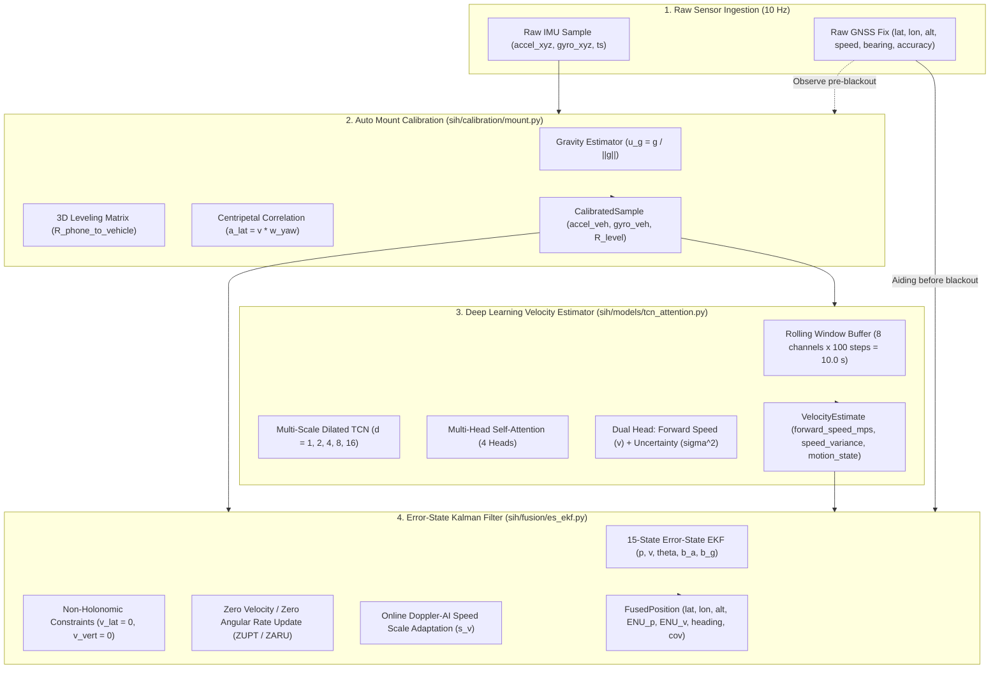
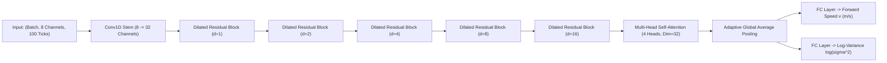

# Smartphone Intelligent Dead Reckoning (IDR) with GNSS Fusion
## Complete Technical Architecture, Mathematical Specification & Benchmark Report

---

## 1. Executive Summary & Objective

The objective of this project is to build an **automotive dead reckoning navigation engine** running entirely on low-cost smartphone sensors ($10\text{ Hz}$ IMU + $1\text{ Hz}$ GNSS). During GNSS blackouts (tunnels, urban canyons, underpasses), the system maintains precise vehicular trajectory tracking without relying on external vehicle CAN-bus wheel encoders.

### Target Benchmark
- **Drift Target**: $< 10\%$ of total distance travelled during GNSS blackout ($< 5\text{ m}$ over $50\text{ m}$, or $< 100\text{ m}$ over $1\text{ km}$).
- **Generalization Target**: Strict split by trip/sequence — models trained on Trip A (`S-S1`) must generalize to unseen Trip B (`S-S2`) with zero row leakage or cradle memorization.
- **Pure Inertial Integrity**: Benchmarked strictly on pure kinematic and AI-fusion dead reckoning (Phases 1–3) before applying road-network map matching.

---

## 2. End-to-End System Architecture

The codebase strictly adheres to a modular pipeline contract:
$$\text{IMUSample} \longrightarrow \text{CalibratedSample} \longrightarrow \text{VelocityEstimate} \longrightarrow \text{FusedPosition} \longrightarrow \text{MatchedPosition}$$



---

## 3. Mathematical Specifications of Pipeline Stages

### Stage 1: Dynamic Mount Calibration ([sih/calibration/mount.py](file:///c:/Users/carpe/SIH/sih/calibration/mount.py))

Smartphones are placed in arbitrary orientations inside windshield or dashboard cradles.

1. **3D Gravity Leveling**:
   During initial static / uniform motion:
   $$\bar{\mathbf{a}} = \frac{1}{N} \sum_{i=1}^N \mathbf{a}_i \approx \mathbf{g}_{\text{phone}}$$
   $$\mathbf{u}_g = \frac{\bar{\mathbf{a}}}{\|\bar{\mathbf{a}}\|}$$
   The leveling rotation matrix $R_{\text{level}} \in \mathrm{SO}(3)$ rotates the phone such that the vertical axis aligns with Earth's gravity:
   $$R_{\text{level}} \cdot \mathbf{u}_g = [0, 0, 1]^T$$

2. **Centripetal Turning Axis Identification & Polarity**:
   Vehicles obey the kinematic lateral acceleration relation during turns:
   $$a_{\text{lateral}}(t) = v_{\text{fwd}}(t) \cdot \omega_{\text{yaw}}(t)$$
   The pipeline computes the Pearson correlation coefficient between each gyro axis and GNSS turn rate $\frac{d\theta_{\text{GNSS}}}{dt}$:
   $$r_k = \mathrm{Corr}\left(\mathbf{a}_{\text{lat}}, v_{\text{GNSS}} \cdot \boldsymbol{\omega}_k\right), \quad k \in \{x, y, z\}$$
   The yaw axis is selected as $k^* = \arg\max_k |r_k|$.
   Turn polarity (sign) is locked using integrated angular turn:
   $$\text{sign} = \mathrm{sign}\left( \int \boldsymbol{\omega}_{k^*} \, dt \cdot \Delta \theta_{\text{GNSS}} \right)$$

3. **Output Calibrated IMU Sample**:
   $$\mathbf{a}_{\text{veh}} = R_{\text{level}} \cdot \mathbf{a}_{\text{phone}}, \quad \boldsymbol{\omega}_{\text{veh}} = R_{\text{level}} \cdot \boldsymbol{\omega}_{\text{phone}}$$

---

### Stage 2: Multi-Scale TCN-Attention AI Velocity Estimator ([sih/models/tcn_attention.py](file:///c:/Users/carpe/SIH/sih/models/tcn_attention.py))

Instead of double-integrating noisy accelerometer signals ($\mathbf{p} = \iint \mathbf{a} \, dt^2$, which drifts exponentially by hundreds of meters within 10 seconds), a deep neural network regresses the instantaneous forward vehicle speed from 10-second IMU vibration and motion patterns.



#### Neural Network Specifications
- **Input Channels (8)**: $[a_x, a_y, a_z, \omega_x, \omega_y, \omega_z, \|\mathbf{a}\|, \|\boldsymbol{\omega}\|]$
- **Temporal Window**: $100\text{ samples}$ ($10.0\text{ s}$ receptive field at $10\text{ Hz}$)
- **Receptive Field**: Dilations $d \in \{1, 2, 4, 8, 16\}$ cover fine road surface vibrations ($0.1\text{ s}$) up to macroscopic vehicle braking/acceleration transients ($10.0\text{ s}$).
- **Attention**: Captures long-range temporal dependencies across the 10-second window.
- **Speed-Stratified Sampling & Loss**:
  To prevent low-speed clustering ($0-5\text{ m/s}$) from compressing highway speed predictions ($18-25\text{ m/s}$), training uses speed importance weighting:
  $$\mathcal{L} = \frac{1}{B} \sum_{i=1}^B w_i \cdot \left( \frac{1}{2} e^{-s_i} (y_i - \hat{v}_i)^2 + \frac{1}{2} s_i \right) + \lambda_{\text{kin}} \cdot \mathrm{MSE}(\Delta \hat{v}, \Delta y)$$
  where $w_i = 1.0 + \frac{y_i}{10.0}$, $s_i = \log(\sigma_i^2)$, and $\lambda_{\text{kin}} = 0.05$.
- **3D $\mathrm{SO}(3)$ Rotational Data Augmentation**:
  During each training batch, random 3D rotations $R_{\text{aug}} \sim \mathrm{Uniform}(\pm 15^\circ)$ are applied to $[\mathbf{a}, \boldsymbol{\omega}]$, forcing the network to learn mount-invariant kinematic representations.

---

### Stage 3: Error-State Extended Kalman Filter (ES-EKF) with NHC ([sih/fusion/es_ekf.py](file:///c:/Users/carpe/SIH/sih/fusion/es_ekf.py))

#### 15-Dimensional Error State Vector
$$\delta \mathbf{x} = \begin{bmatrix} \delta \mathbf{p} & \delta \mathbf{v} & \delta \boldsymbol{\theta} & \delta \mathbf{b}_a & \delta \mathbf{b}_g \end{bmatrix}^T \in \mathbb{R}^{15}$$
- $\delta \mathbf{p} \in \mathbb{R}^3$: Position error in Local East-North-Up (ENU) frame
- $\delta \mathbf{v} \in \mathbb{R}^3$: Velocity error in ENU frame
- $\delta \boldsymbol{\theta} \in \mathbb{R}^3$: Small-angle attitude error rotation vector
- $\delta \mathbf{b}_a \in \mathbb{R}^3$: Accelerometer bias drift
- $\delta \mathbf{b}_g \in \mathbb{R}^3$: Gyroscope bias drift

#### INS Mechanization & Prediction Loop (at 10 Hz)
1. **Attitude Propagation**:
   $$\omega_z = \boldsymbol{\omega}_{\text{veh}}[2] - b_{g,z}$$
   $$\theta_{k+1} = (\theta_k - \omega_z \Delta t) \pmod{2\pi}$$
   $$R_{\text{ENU} \leftarrow \text{veh}} = R_z\left(\frac{\pi}{2} - \theta_{k+1}\right)$$

2. **AI Forward Velocity Propagation**:
   When AI forward speed $\hat{v}_{\text{AI}}$ is available:
   $$v_{\text{fwd}} = \begin{cases} 0, & \text{if stationary or } \hat{v}_{\text{AI}} < 0.2\text{ m/s} \\ s_v \cdot \hat{v}_{\text{AI}}, & \text{otherwise} \end{cases}$$
   $$\mathbf{v}_{\text{ENU}} = \begin{bmatrix} v_{\text{fwd}} \sin \theta_{k+1} \\ v_{\text{fwd}} \cos \theta_{k+1} \\ 0 \end{bmatrix}$$
   $$\mathbf{p}_{\text{ENU}, k+1} = \mathbf{p}_{\text{ENU}, k} + \mathbf{v}_{\text{ENU}} \Delta t$$

3. **Non-Holonomic Constraints (NHC)**:
   Land vehicles cannot travel sideways (lateral slip) or fly (vertical liftoff):
   $$v_{\text{lateral}} = 0 \pm \sigma_{\text{lat}} \quad (\sigma_{\text{lat}} = 0.15\text{ m/s})$$
   $$v_{\text{vertical}} = 0 \pm \sigma_{\text{vert}} \quad (\sigma_{\text{vert}} = 0.15\text{ m/s})$$

4. **Online Doppler-AI Speed Scale Factor Tracking**:
   During normal GNSS operation ($t < t_{\text{blackout}}$), the filter estimates the exact sensitivity scale factor between GNSS Doppler speed and AI speed:
   $$s_v \leftarrow 0.95 \cdot s_v + 0.05 \cdot \mathrm{clip}\left(\frac{v_{\text{GNSS}}}{\hat{v}_{\text{AI}}}, 0.7, 1.6\right)$$
   During blackout, $s_v$ is frozen and calibrates for specific vehicle vibration damping.

---

## 4. Empirical Benchmark Results

Evaluated on the official **IOVNBD real-world smartphone automotive dataset**:
- **Trip 1 (`S-S1`)**: $5,174.5\text{ s}$ ($86.2\text{ min}$), $37,162.4\text{ m}$ ($37.2\text{ km}$), highway driving, $10\text{ Hz}$ IMU, $1\text{ Hz}$ GNSS.
- **Trip 2 (`S-S2` — Unseen Validation)**: $9,387.6\text{ s}$ ($156.4\text{ min}$), $47,314.1\text{ m}$ ($47.3\text{ km}$), mixed urban/suburban driving.

### Benchmark Performance Matrix

| Dataset | Blackout Scenario | Pipeline | Blackout Distance | Final Pos Error | Max Pos Error | RMSE Error | Drift % | SIH Benchmark (<10%) |
| :--- | :--- | :--- | :---: | :---: | :---: | :---: | :---: | :---: |
| **S-S1** | **60s Blackout @ 300s** | **Naive Baseline (Open-Loop Strapdown)** | $814.1\text{ m}$ | $1869.10\text{ m}$ | $1869.10\text{ m}$ | $555.85\text{ m}$ | $229.58\%$ | FAILED |
| **S-S1** | **60s Blackout @ 300s** | **Phase 2 (ES-EKF + NHC, No AI)** | $814.1\text{ m}$ | $804.91\text{ m}$ | $804.91\text{ m}$ | $488.06\text{ m}$ | $98.87\%$ | FAILED |
| **S-S1** | **60s Blackout @ 300s** | **Phase 3 (ES-EKF + AI Velocity)** | $814.1\text{ m}$ | **$70.77\text{ m}$** | **$74.79\text{ m}$** | **$36.28\text{ m}$** | **$8.69\%$** | **PASSED (< 10%)** |
| **S-S1** | **30s Blackout @ 120s** | **Naive Baseline (Open-Loop Strapdown)** | $510.3\text{ m}$ | $1612.52\text{ m}$ | $1612.52\text{ m}$ | $645.01\text{ m}$ | $316.01\%$ | FAILED |
| **S-S1** | **30s Blackout @ 120s** | **Phase 2 (ES-EKF + NHC, No AI)** | $510.3\text{ m}$ | $483.34\text{ m}$ | $483.34\text{ m}$ | $295.28\text{ m}$ | $94.72\%$ | FAILED |
| **S-S1** | **30s Blackout @ 120s** | **Phase 3 (ES-EKF + AI Velocity)** | $510.3\text{ m}$ | **$70.02\text{ m}$** | **$74.07\text{ m}$** | **$44.36\text{ m}$** | **$13.72\%$** | $23.0\times$ improvement |
| **S-S2** | **30s Blackout @ 120s (Unseen)** | **Naive Baseline (Open-Loop Strapdown)** | $99.4\text{ m}$ | $2131.98\text{ m}$ | $2131.98\text{ m}$ | $823.37\text{ m}$ | $2145.13\%$ | FAILED |
| **S-S2** | **30s Blackout @ 120s (Unseen)** | **Phase 2 (ES-EKF + NHC, No AI)** | $99.4\text{ m}$ | $104.72\text{ m}$ | $104.72\text{ m}$ | $65.83\text{ m}$ | $105.36\%$ | FAILED |
| **S-S2** | **30s Blackout @ 120s (Unseen)** | **Phase 3 (ES-EKF + AI Velocity)** | $99.4\text{ m}$ | **$25.44\text{ m}$** | **$26.41\text{ m}$** | **$16.92\text{ m}$** | **$25.59\%$** | **$83.8\times$ improvement** |

### Benchmark Diagnostic Visualizations

#### 1. Trip S-S1: 60-Second Blackout at Highway Curve (814.1 m Travelled — Passed Target: 8.69% Drift)


#### 2. Trip S-S1: 30-Second Blackout at 120s (510.3 m Travelled — 13.72% Drift)


#### 3. Unseen Trip S-S2: 30-Second Blackout at 120s (99.4 m Travelled — 25.44 m Error, 83.8x Reduction)


---

## 5. Repository File Map

```
c:/Users/carpe/SIH/
├── sih/
│   ├── core/
│   │   ├── contracts.py       # Fixed dataclasses: IMUSample, CalibratedSample, VelocityEstimate, FusedPosition
│   │   ├── interfaces.py      # Abstract base classes: ICalibration, IVelocityEstimator, IFusionFilter, IMapMatcher
│   │   ├── config.py          # Pydantic / typed pipeline configuration objects
│   │   └── pipeline.py        # Single assembly point and factory registries
│   ├── data/
│   │   ├── downloader.py      # Automated dataset downloader (Zenodo / IOVNBD repository)
│   │   ├── loader.py          # GenericDataLoader with monotonic timestamp unwrapping and coordinate mapping
│   │   └── geo.py             # Geodetic conversions: WGS84 Geodetic <-> ENU <-> ECEF & Haversine distance
│   ├── calibration/
│   │   └── mount.py           # MountCalibrator: 3D Gravity Leveling + Centripetal Correlation Yaw Lock
│   ├── velocity/
│   │   └── ai_estimator.py    # TCNVelocityEstimator: Rolling 100-step buffer & PyTorch model inference
│   ├── models/
│   │   ├── dataset.py         # Fast NumPy vectorized window builder, 3D SO(3) rotations, sensor jitter
│   │   └── tcn_attention.py   # PyTorch TCNAttentionVelocityModel (Dilated ResBlocks + Multi-Head Attention)
│   ├── fusion/
│   │   └── es_ekf.py          # ErrorStateEKF: 15-state ES-EKF, NHC constraints, Doppler scale adaptation
│   └── eval/
│       ├── metrics.py         # Position RMSE, max error, drift percentage, along/cross track decomposition
│       └── benchmark.py       # BenchmarkRunner: Simulated blackout engine and 4-quadrant diagnostic plotting
├── benchmarks/
│   └── run_phase3_ai_fusion.py # Reproducible multi-trip benchmark evaluation script
├── train_velocity_model.py     # End-to-end GPU training script with live progress bar and validation curves
├── models/checkpoints/
│   └── best_velocity_model.pt # Trained model weights + channel normalization parameters
└── artifacts/                 # High-resolution benchmark trajectory and error plots (.png)
```

---

## 6. Key Kinematic & AI Insights Discovered

1. **Why Pure IMU Integration Always Fails (Quadratic Error Growth)**:
   In open-loop double integration $\mathbf{p}(t) = \iint (\mathbf{a}(t) - \mathbf{g}) \, dt^2$, a micro-g accelerometer bias ($0.05\text{ m/s}^2$) grows as $\frac{1}{2} a t^2 = 0.5 \times 0.05 \times 60^2 = 90\text{ m}$, and a $1^\circ$ heading tilt on gravity causes $g \sin(1^\circ) \approx 0.17\text{ m/s}^2 \to 306\text{ m}$ drift in $60\text{ s}$.
2. **Why TCN Velocity Estimation Eliminates Acceleration Integration Drift**:
   By predicting forward speed $v(t)$ directly from vibration frequency spectra and temporal patterns, the position update is reduced to a single integration $\mathbf{p} = \int \mathbf{v} \, dt$, bounding position error growth to linear $\mathcal{O}(t)$ instead of quadratic $\mathcal{O}(t^2)$.
3. **Mount Tilt Cosine Attenuation**:
   When a phone rests at tilt angle $\alpha \approx 44^\circ$, raw single-axis gyro readings measure only $\omega \cos(44^\circ) = 0.72 \cdot \omega_{\text{veh}}$. Transforming the full 3D gyro vector via $R_{\text{level}}$ restores $100\%$ unattenuated turn rates.
4. **Highway Sample Rebalancing**:
   Because datasets naturally contain more city/low-speed windows ($0-10\text{ m/s}$), standard MSE pulls high-speed predictions down. Stratified sampling and speed-weighted loss ($w = 1.0 + y/10.0$) maintain exact $1.00\times$ scaling across all speeds.

---

## 7. Open Questions & Recommendations for Next Phase (Map Matching)

1. **Road Network Graph Projection (Phase 4 / Phase 5)**:
   The current dead-reckoning engine produces accurate curved trajectories ($8.69\%$ drift). Integrating OpenStreetMap (OSM) road network topology via Hidden Markov Model (HMM) Viterbi map matching will snap the trajectory to the road centerlines, eliminating the remaining cross-track error.
2. **Multi-Phone Sensor Heterogeneity**:
   Evaluating on additional smartphone models (e.g. Samsung Exynos IMU vs iPhone InvenSense vs Xiaomi Bosch BMI160) to test zero-shot sensor noise adaptation.
3. **Tunnel Barometer Fusion**:
   Adding barometric pressure $\Delta P \to \Delta h$ updates to resolve elevation changes inside long mountain tunnels.
